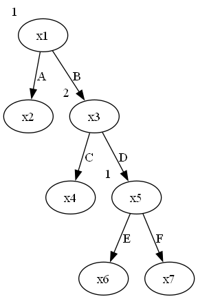
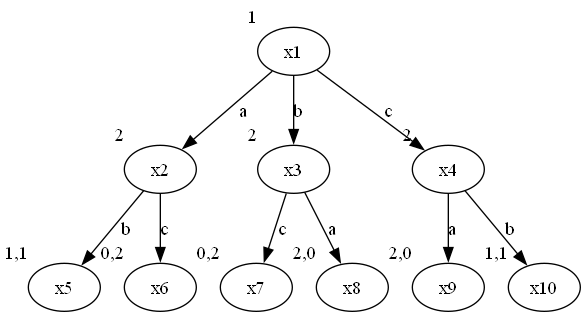
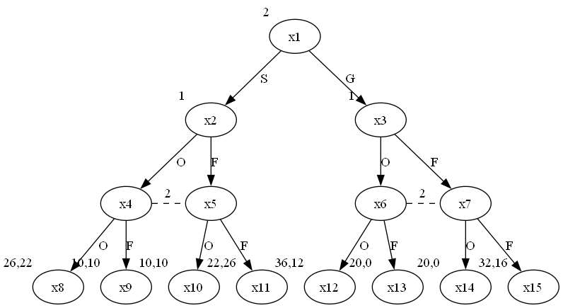
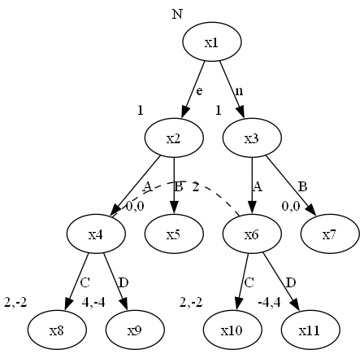

## Problem Set 4
### 1. ST Exercise 7.2
#### (a)
The game is perfect information. The game tree is as followed:

#### (b)
- $4$ terminal nodes : $x_2,x_4,x_6,x_7$
- $3$ information sets : $\{x_1\},\{x_3\},\{x_5\}$
#### (c)
- Player1 has $4$ : $AE,BE,AF,BF$
- Player2 has $2$ : $C,D$
#### (d)
<table>
    <tr>
        <th colspan="2" style="border:none;"></th>
        <th colspan="2" style="border:none; text-align:center">Player2</th>
    </tr>
    <tr>
        <th colspan="2" style="border:none;"></th>
        <th style="border:none; text-align:center;">C</th>
        <th style="border:none; text-align:center;">D</th>
    </tr>
    <tr>
        <th rowspan="4" style="border:none; text-align:center; vertical-align:middle">Player1</th>
        <th style="border:none; text-align:center;">AE</th>
        <td style="border: 1px solid black; text-align:center; vertical-align:middle;">2, 0</td>
        <td style="border: 1px solid black; text-align:center; vertical-align:middle;">2, 0</td>
    </tr>
    <tr>
        <th style="border:none; text-align:center;">AF</th>
        <td style="border: 1px solid black; text-align:center; vertical-align:middle;">2, 0</td>
        <td style="border: 1px solid black; text-align:center; vertical-align:middle;">2, 0</td>
    </tr>
    <tr>
        <th style="border:none; text-align:center;">BE</th>
        <td style="border: 1px solid black; text-align:center; vertical-align:middle;">3, 1</td>
        <td style="border: 1px solid black; text-align:center; vertical-align:middle;">0, 0</td>
    </tr>
    <tr>
        <th style="border:none; text-align:center;">BF</th>
        <td style="border: 1px solid black; text-align:center; vertical-align:middle;">3, 1</td>
        <td style="border: 1px solid black; text-align:center; vertical-align:middle;">1, 2</td>
    </tr>
</table>

- Pure strategy Nash equilibria 
$ (AE, D),(AF, D),(BE, C) $
- Equilibria in which player 2 choose $D$
player1 will mix between AE and AF and there are no difference. Hence $(\sigma \circ AE+ (1-\sigma)\circ AF, D)$ is a Nash equilibrium for $\sigma \in (0,1)$
- Equilibria in which player 2 choose $C$
player1 will mix between BE and BF nad there are no difference. For player2 to have no willing to change to D. We have
$$1\times \sigma_1(BE)+1\times (1-\sigma_1(BE))\ge 2\times (1-\sigma_1(BE))\Rightarrow \sigma_1(BE)\ge \frac{1}{2}$$
Hence $(\sigma \circ BE+ (1-\sigma)\circ BF, C)$ is a Nash equilibrium for $\sigma \in [\frac{1}{2},1)$
- Equilibria in which player 2 mixes
BF is strictly better than BE : $\sigma_1(BE)=0$
When $\sigma_1(BE)=0 $ and $\sigma_1(BF)>0$ , $D$  is strictly better than $C$. That means $\sigma_1(BF)=0$. 
To guarantee that player 1 has no incentive to deviate, we have
$$2\sigma_2(C)+2(1-\sigma_2(C))\ge 3\sigma_2(C)+(1-\sigma_2(c))\Rightarrow \sigma_2(C)\leq \frac{1}{2}$$
Thus $(\sigma_1 \circ AE+ (1-\sigma_1)\circ AF, \sigma_2 \circ C+ (1-\sigma_2)\circ D)$ is a mixed Nash equilibrium for $\sigma_1\in [0,1], \sigma_2\in (0,\frac{1}{2}]$

### 2. ST Exercise 7.3
#### (a) 
This game is a game of perfect information, because every player, whenever called upon to move, perfectly observes what has happened previously.
#### (b)
Player 2 has $2\times 9 = 18$ information sets, corresponding to each of Player 1's first moves
#### (c)
Player 2 can only choose one move in $8$ squares in the first round, so the number of information sets of Player 1 after Player 2's first round is $18\times 8=144$
#### (d)
Number of information sets of Player 2:
$$2\left( \frac{9!}{8!} + \frac{9!}{6!}+ \frac{9!}{4!}+ \frac{9!}{2!}\right)=394146$$
Number of information sets of Player 1:
$$ \frac{9!}{9!} + 2\left( \frac{9!}{7!} + \frac{9!}{5!}+ \frac{9!}{3!}+ \frac{9!}{1!}\right)=852913$$
#### (e)
The number of final nodes is the number of information sets of player 1 in the last round, which is $2\times 9!=725760$

### 3 ST Exercise 7.5
#### (a)

where $v_1(a)=v_2(c)=2,v_1(b)=v_2(b)=1,v_1(c)=v_2(a)=0$
#### (b)
- 3 pure strategies for player1 : $\{a,b,c\}$
- 8 pure strategies for player2 : $\{bca,bcb,baa,bab,cca,ccb,caa,cab\}$
#### (c)
There are no mixed strategy Nash equilibria because we cannot get the value of utility.
The best response functions:
$$\begin{align*}BR_1(s_2)&=\begin{cases}c,\quad &s_2\in \{bca,cca,ccb\},\\b,&s_2\in\{bab,cab\},\\\{b,c\},&s_2\in \{baa,caa\},\\\{a,c\},&s_2=bcb,\end{cases}\\BR_2(s_1)&=\begin{cases}\{cca,ccb,caa,cab\}, \quad &s_1=a,\\\{bca,bcb,cca,ccb\}, &s_1=b,\\\{bcb,bab,ccb,cab\},&s_1=c\end{cases}\end{align*}$$
And the Nash equilibria : $(c,bcb),(c,ccb)$.
### 4 ST Exercise 7.8
#### (a)

Let $S$ denote splitting 10 − 10 and $G$ denote giving 20 in the first stage.
#### (b)
- $S1 = \{OO, OF, FO, FF \}$
- $S2 = \{SOO, SOF, SF O, SF F, GOO, GOF, GF O, GF F \}$
#### (c)

<table>
    <tr>
        <th colspan="2" style="border:none;"></th>
        <th colspan="8" style="border:none; text-align:center">Player2</th>
    </tr>
    <tr>
        <th colspan="2" style="border:none;"></th>
        <th style="border:none; text-align:center;">SOO</th>
        <th style="border:none; text-align:center;">SOF</th>
        <th style="border:none; text-align:center;">SFO</th>
        <th style="border:none; text-align:center;">SFF</th>
        <th style="border:none; text-align:center;">GOO</th>
        <th style="border:none; text-align:center;">GOF</th>
        <th style="border:none; text-align:center;">GFO</th>
        <th style="border:none; text-align:center;">GFF</th>
    </tr>
    <tr>
        <th rowspan="4" style="border:none; text-align:center; vertical-align:middle">Player1</th>
        <th style="border:none; text-align:center;">OO</th>
        <td style="border: 1px solid black; text-align:center; vertical-align:middle;">26,22</td>
        <td style="border: 1px solid black; text-align:center; vertical-align:middle;">26,22</td>
        <td style="border: 1px solid black; text-align:center; vertical-align:middle;">10,10</td>
        <td style="border: 1px solid black; text-align:center; vertical-align:middle;">10,10</td>
        <td style="border: 1px solid black; text-align:center; vertical-align:middle;">36,12</td>
        <td style="border: 1px solid black; text-align:center; vertical-align:middle;">20,0</td>
        <td style="border: 1px solid black; text-align:center; vertical-align:middle;">36,12</td>
        <td style="border: 1px solid black; text-align:center; vertical-align:middle;">20,0</td>
    </tr>
    <tr>
        <th style="border:none; text-align:center;">OF</th>
        <td style="border: 1px solid black; text-align:center; vertical-align:middle;">26,22</td>
        <td style="border: 1px solid black; text-align:center; vertical-align:middle;">26,22</td>
        <td style="border: 1px solid black; text-align:center; vertical-align:middle;">10,10</td>
        <td style="border: 1px solid black; text-align:center; vertical-align:middle;">10,10</td>
        <td style="border: 1px solid black; text-align:center; vertical-align:middle;">20,0</td>
        <td style="border: 1px solid black; text-align:center; vertical-align:middle;">32,16</td>
        <td style="border: 1px solid black; text-align:center; vertical-align:middle;">20,0</td>
        <td style="border: 1px solid black; text-align:center; vertical-align:middle;">32,16</td>
    </tr>
    <tr>
        <th style="border:none; text-align:center;">FO</th>
        <td style="border: 1px solid black; text-align:center; vertical-align:middle;">10,10</td>
        <td style="border: 1px solid black; text-align:center; vertical-align:middle;">10,10</td>
        <td style="border: 1px solid black; text-align:center; vertical-align:middle;">22,26</td>
        <td style="border: 1px solid black; text-align:center; vertical-align:middle;">22,26</td>
        <td style="border: 1px solid black; text-align:center; vertical-align:middle;">36,12</td>
        <td style="border: 1px solid black; text-align:center; vertical-align:middle;">20,0</td>
        <td style="border: 1px solid black; text-align:center; vertical-align:middle;">36,12</td>
        <td style="border: 1px solid black; text-align:center; vertical-align:middle;">20,0</td>
    </tr>
    <tr>
        <th style="border:none; text-align:center;">FF</th>
        <td style="border: 1px solid black; text-align:center; vertical-align:middle;">10,10</td>
        <td style="border: 1px solid black; text-align:center; vertical-align:middle;">10,10</td>
        <td style="border: 1px solid black; text-align:center; vertical-align:middle;">22,26</td>
        <td style="border: 1px solid black; text-align:center; vertical-align:middle;">22,26</td>
        <td style="border: 1px solid black; text-align:center; vertical-align:middle;">20,0</td>
        <td style="border: 1px solid black; text-align:center; vertical-align:middle;">32,16</td>
        <td style="border: 1px solid black; text-align:center; vertical-align:middle;">20,0</td>
        <td style="border: 1px solid black; text-align:center; vertical-align:middle;">32,16</td>
    </tr>
</table>

#### (d)
Note that for Player 2, $GOO,GOF,GFO,GFF$ are strictly dominated by $SOO,SOF,SFO,SFF$. Thus we could focus on the reduced form of the game:
<table>
    <tr>
        <th colspan="2" style="border:none;"></th>
        <th colspan="2" style="border:none; text-align:center">Player2</th>
    </tr>
    <tr>
        <th colspan="2" style="border:none;"></th>
        <th style="border:none; text-align:center;">SO</th>
        <th style="border:none; text-align:center;">SF</th>
    </tr>
    <tr>
        <th rowspan="2" style="border:none; text-align:center; vertical-align:middle">Player1</th>
        <th style="border:none; text-align:center;">O</th>
        <td style="border: 1px solid black; text-align:center; vertical-align:middle;">26, 22</td>
        <td style="border: 1px solid black; text-align:center; vertical-align:middle;">10, 10</td>
    </tr>
    <tr>
        <th style="border:none; text-align:center;">F</th>
        <td style="border: 1px solid black; text-align:center; vertical-align:middle;">10, 10</td>
        <td style="border: 1px solid black; text-align:center; vertical-align:middle;">22, 26</td>
    </tr>
</table>

The Nash equilibria of the reduced form are $(O,SO),(F,SF),(\frac{4}{7}\circ O+\frac{3}{7}\circ F,\frac{3}{7}\circ SO+\frac{4}{7}\circ SF)$
Then the Nash equilibria of the original form are
$$
\left\{ \left( p \circ OO + (1 - p) \circ OF , q \circ SOO + (1 - q) \circ SOF \right) : p, q \in [0, 1] \right\}\\
\cup
\left\{ \left( p \circ FO + (1 - p) \circ FF , q \circ SFO + (1 - q) \circ SFF \right) : p, q \in [0, 1] \right\}\\
\cup
\left\{
\begin{aligned}
&\left( p_1 \circ OO + \left( \frac{4}{7} - p_1 \right) \circ OF + p_2 \circ FO + \left( \frac{3}{7} - p_2 \right) \circ FF , \right. \\
&\left. q_1 \circ SOO + \left( \frac{3}{7} - q_1 \right) \circ SOF + q_2 \circ SFO + \left( \frac{4}{7} - q_2 \right) \circ SFF \right) : \\
& p_1, q_2 \in \left[0, \frac{4}{7}\right], p_2, q_1 \in \left[0, \frac{3}{7}\right]
\end{aligned}
\right\}
$$

### 5 ST Exercise 7.9
#### (a)

#### (b)

<table>
    <tr>
        <th colspan="2" style="border:none;"></th>
        <th colspan="2" style="border:none; text-align:center">Player2</th>
    </tr>
    <tr>
        <th colspan="2" style="border:none;"></th>
        <th style="border:none; text-align:center;">C</th>
        <th style="border:none; text-align:center;">D</th>
    </tr>
    <tr>
        <th rowspan="4" style="border:none; text-align:center; vertical-align:middle">Player1</th>
        <th style="border:none; text-align:center;">AA</th>
        <td style="border: 1px solid black; text-align:center; vertical-align:middle;">2, -2</td>
        <td style="border: 1px solid black; text-align:center; vertical-align:middle;">0, 0</td>
    </tr>
    <tr>
        <th style="border:none; text-align:center;">AB</th>
        <td style="border: 1px solid black; text-align:center; vertical-align:middle;">1, -1</td>
        <td style="border: 1px solid black; text-align:center; vertical-align:middle;">2, -2</td>
    </tr>
    <tr>
        <th style="border:none; text-align:center;">BA</th>
        <td style="border: 1px solid black; text-align:center; vertical-align:middle;">1, -1</td>
        <td style="border: 1px solid black; text-align:center; vertical-align:middle;">-2, 2</td>
    </tr>
    <tr>
        <th style="border:none; text-align:center;">BB</th>
        <td style="border: 1px solid black; text-align:center; vertical-align:middle;">0, 0</td>
        <td style="border: 1px solid black; text-align:center; vertical-align:middle;">0, 0</td>
    </tr>
</table>

#### (c)
Note that BB is strictly dominated by AB, BA is strictly dominated by AA for player1.
There are no pure strategy Nash equilibrium and equilibrium in which only one player mixes.Consider the mixed one, we have
$$2\sigma_2(C)=\sigma_2(C)+2(1-\sigma_2(C))\Rightarrow \sigma_2(C)=\frac{2}{3}$$
$$-2\sigma_1(AA)-(1-\sigma_1(AA))=-2(1-\sigma_1(AA))\Rightarrow\sigma_1(AA)=\frac{1}{3}$$
Hence there are only one Nash equilibrium: $(\frac{1}{3}\circ AA+\frac{2}{3} AB,\frac{2}{3}\circ C+\frac{1}{3}\circ D)$