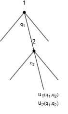
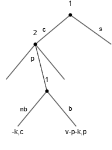

## Problem Set 5
2024/10/28
徐靖 2200012917

### 1. ST Exercise 8.4
#### (a)
There are infinite subgames because every quantity choice of firm $1$ leads to a proper subgames.
#### (b)
This is a game of imperfect information because players 2 and 3 make their choices without observing each other’s choice.
#### (c)
There exists a unique Nash equilibrium when player 1 choose $q_1$:
$$q_2^*(q_1) = q_3^*(q_1) = \begin{cases}\frac{a-c-q_1}{3}, \quad &q_1\leq a-c,\\ 0,& \text{o.w.}\end{cases}$$
Back to the player 1's choose, consider the first order condition, we have
$$q_1 = \frac{a-c}{2}$$
Thus we find the unique SPE: 
$$q_1 = \frac{a-c}{2}, q_2^*(q_1) = q_3^*(q_1) = \begin{cases}\frac{a-c-q_1}{3}, \quad &q_1\leq a-c,\\ 0,& \text{o.w.}\end{cases}$$

#### (d)
$$q_1 = \frac{a-c}{2}, q_2^*(q_1) = q_3^*(q_1) = \begin{cases}\frac{a-c-q_1}{3}, \quad &q_1 =  a-c,\\ a,& \text{o.w.}\end{cases}$$
is a Nash equilibrium but not SPE. Because when player 1 doesn't choose $\frac{a-c}{2}$, firm 2 and 3 will get negative profits. 
___
### 2. ST Exercise 8.6 
#### (a)
Consider the optimization problem of companies 1 and 2 in two cases respectively:
$$
\begin{align*}
\max_{q_i} q_i(100-10-q_1-q_2)
\end{align*}
$$
which leads to $q_1=q_2 = 30$.The profit of firm 1 is $900$.
And
$$
\begin{cases}
\max_{q_2} q_2(100-10-q_1-q_2)\\
\max_{q_1} q_1(100-5-q_1-q_2) - F\\
\end{cases}
$$
which leads to $q_1=\frac{100}{3}, q_2=\frac{85}{3}$. The profit of firm 1 is $\frac{10000}{9}- F$.
Thus there is a unique subgame-perfect equilibrium involving firm 1 investing $\Leftrightarrow$ $\frac{10000}{9}- F>900 $. Hence $F^*\in (0,\frac{1900}{9})$
#### (b)
$$(q_1,q_2) = \begin{cases}(30,30) \quad & \text{not investing}\\ (0,0) & \text{investing} \end{cases}$$
It is a Nash equilibrium because when (not investing,30,30) both firms would not deviate.  It is not a subgame-perfect equilibrium, because $q_2 = 0$ is not firm 2’s best response when firm 1 invests.
### 3. ST Exercise 8.9

#### (a) 
In the normal form of the game, firms are represented by the set \( N = \{1, 2\} \). Each firm \( i \in N \) has a strategy space \( S_i = [0, +\infty) \). The payoff function for firm \( i \) is given by:

\[
u_i(q_i, q_{-i}) = \max\{100 - q_1 - q_2, 0\} q_i - k \chi_{\{q_i > 0\}}
\]

where \( \chi_{\{q_i > 0\}} \) is the indicator function for \( q_i > 0 \).

#### (b) 
The best response of firm \( i \) is:

\[
q_i^*(q_j) = 
\begin{cases} 
\frac{100 - q_j}{2}, & \text{if } q_j < 100 - 20\sqrt{10} \\ 
\{10\sqrt{10}, 0\}, & \text{if } q_j = 100 - 20\sqrt{10} \\ 
0, & \text{if } q_j > 100 - 20\sqrt{10} 
\end{cases}
\]

This results in three pure Nash equilibria: \( \left(\frac{100}{3}, \frac{100}{3}\right), (50, 0), (0, 50) \).

#### (c)

    

For \( k = 25 \), firm 2's best response becomes:

\[
q_2^*(q_1) = 
\begin{cases} 
\frac{100 - q_1}{2}, & \text{if } q_1 < 90 \\ 
0, & \text{if } q_1 \geq 90 
\end{cases}
\]

Firm 1 then maximizes:

\[
\max_{q_1 < 90} \left\{ \left(100 - q_1 - \frac{100 - q_1}{2}\right) q_1 \right\}
\]

The optimal solution is \( q_1 = 50 \), leading to \( q_2 = 25 \), with positive payoffs \( u_1 = (100 - 50 - 25) \times 50 - 25 > 0 \) and \( u_2 = 25 \times 25 - 25 > 0 \). Choosing \( q_1 \geq 90 \) yields lower profits.

#### (d)
For \( k = 725 \), firm 2's best response is:

\[
q_2^*(q_1) = 
\begin{cases} 
\frac{100 - q_1}{2}, & \text{if } q_1 < 100 - 10\sqrt{29} \\ 
0, & \text{if } q_1 \geq 100 - 10\sqrt{29} 
\end{cases}
\]

At \( q_1 \geq 100 - 10\sqrt{29} \), firm 2 exits, and firm 1 maximizes:

\[
\max_{q_1 \geq 100 - 10\sqrt{29}} \left\{ (100 - q_1) q_1 \right\}
\]

The solution is \( q_1 = 50 \), yielding \( u_1 = 2500 - 725 = 1775 > 0 \) and \( u_2 = 0 \).

If \( q_1 < 100 - 10\sqrt{29} \), firm 1 solves:

\[
\max_{q_1 < 100 - 10\sqrt{29}} \left\{ \left(100 - q_1 - \frac{100 - q_1}{2}\right) q_1 \right\}
\]

Verifying the profits shows that the backward induction solution is unique, with \( q_1 = 50 \) and:

\[
q_2 = 
\begin{cases} 
\frac{100 - q_1}{2}, & \text{if } q_1 < 100 - 10\sqrt{29} \\ 
0, & \text{if } q_1 \geq 100 - 10\sqrt{29} 
\end{cases}
\]

### 4. ST Exercise 8.12

#### (a)
This game features perfect information with two players \( i \in \{1, 2\} \). The strategy sets are \( S_1 = X = [0, 5] \) for player 1, and \( S_2 = \{A, R\} \) for player 2, where \( A \) means accepting the proposal \( x \in X \), and \( R \) means rejecting it to maintain the status quo \( q = 4 \). The payoffs are defined as:

\[
v_1(s_1, s_2) = 
\begin{cases} 
10 - |s_1 - 1|, & \text{if } s_2 = A \\ 
7, & \text{if } s_2 = R 
\end{cases}
\]

\[
v_2(s_1, s_2) = 
\begin{cases} 
10 - |s_1 - 3|, & \text{if } s_2 = A \\ 
9, & \text{if } s_2 = R 
\end{cases}
\]

#### (b)
Player 2 can secure a payoff of 9 by opting for \( R \). Thus, his best response is to choose \( A \) if \( 10 - |s_1 - 3| > 9 \), valid for \( s_1 \in (2, 4) \). For \( s_1 > 4 \) or \( s_1 < 2 \), \( R \) is preferred, and he is indifferent at \( s_1 = 2 \) or \( s_1 = 4 \).

If player 2 accepts \( s_1 = 2 \), it leads to subgame-perfect equilibria since player 1 can propose any \( s_1 \in (2, 4) \) to maximize their payoff close to 1. Consequently, accepting \( s_1 = 2 \) is a valid strategy for player 2. The two subgame-perfect equilibria yield payoffs \( (v_1, v_2) = (9, 9) \).

#### (c)
One Nash equilibrium occurs when player 2 states, "I will reject anything except \( s_1 = 3 \)," and player 1 selects \( s_1 = 3 \). In this case, player 1 receives 8, while any other choice results in a payoff of 7. Player 1's best response to player 2's strategy is indeed to choose \( s_1 = 3 \), leading to payoffs \( (v_1, v_2) = (8, 10) \).

Since player 2 can guarantee a payoff of 9, there are infinite Nash equilibria where player 2 can adopt the strategy "I will reject anything except \( s_1 = x \)" for \( x \in [2, 4) \). Player 1 would prefer \( x \) over 4, ensuring player 2 accepts. Both players remain indifferent at \( x = 4 \), which also constitutes a Nash equilibrium.

### 5. ST Exercise 8.13

#### (a)

    

Buyer's best response to the seller's offer is:

\[
BR_1(c, p) = 
\begin{cases} 
b, & \text{if } p < v \\ 
\{b, nb\}, & \text{if } p = v \\ 
nb, & \text{if } p > v 
\end{cases}
\]

#### (b)
Using backward induction, the buyer should reject the offer when \( p < v \) and accept when \( p > v \). The buyer is indifferent at \( p = v \). If the buyer rejects at \( p = v \), the seller has no best response since they could instead offer \( p' = \frac{p + v}{2} > p \) to improve their payoff.

Thus, in a subgame-perfect equilibrium, the buyer accepts \( p = v \), and the seller offers \( p = v \). In this case, the buyer only incurs a cost of \( -k \) if commuting to the store, leading them to stay home. This results in a unique backward induction solution where the buyer stays home, the seller proposes \( p = v \) if the buyer commutes, and the buyer accepts any \( p \geq v \) while rejecting others.

The equilibrium outcome is \( (0, c) \), which is Pareto dominated by \( (0, v - k) \) from the scenario where the buyer commutes and accepts \( p = v - k \). Thus, this outcome is not Pareto optimal.

#### (c)
Consider a strategy where the buyer commutes, the seller proposes \( p = \frac{v - k + c}{2} > c \), and the buyer only accepts this price while rejecting others. It’s clear that neither party has an incentive to deviate. The payoff for this strategy profile is:

\[
\left(\frac{v - k - c}{2}, \frac{v - k + c}{2}\right)
\]

This payoff is strictly higher than \( (0, c) \).

#### (d)
If the seller sends a postcard, he sets the price before the buyer decides whether to leave home, changing the game's timing. Backward induction indicates that the buyer should leave home and purchase when \( p < v - k \), stay home when \( p > v - k \), and be indifferent at \( p = v - k \). Similar to part (b), in a subgame-perfect equilibrium, the buyer accepts \( p = v - k \), and the seller offers \( p = v - k \). 

The buyer’s payoff remains 0, but the seller's payoff becomes \( p - \epsilon = v - k - \epsilon > c \), making the seller better off than in the equilibrium of part (b) where no postcard is sent. When the seller commits to \( c + \epsilon < p < v - k \), the buyer will choose to buy, resulting in both being better off. Thus, the seller has an incentive to send the postcard.
