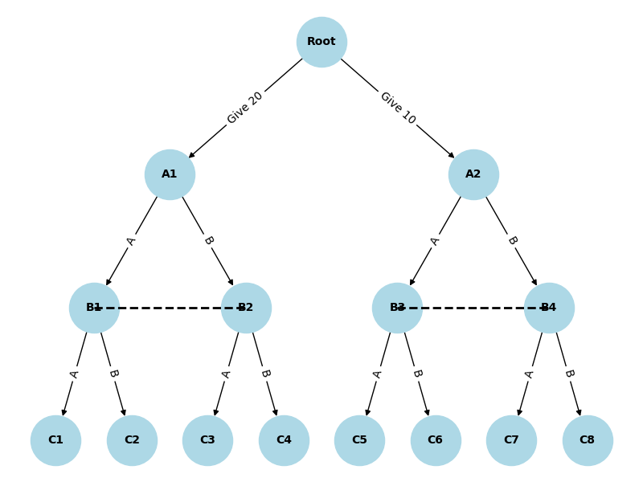

# 2024/10/8
2200012917 徐靖
## 1
#### (1)
玩家2有 $9$ 个信息集,对应玩家1的每个第一步
#### (2)
玩家2的第一轮只能在 $8$ 个方格内择一落子,因此玩家1在玩家2第一轮后的信息集个数为 $9\times 8=72$ 个
#### (3)
玩家2信息集个数:
$$ \frac{9!}{8!} + \frac{9!}{6!}+ \frac{9!}{4!}+ \frac{9!}{2!}=197073$$
玩家1信息集个数:
$$ \frac{9!}{9!} + \frac{9!}{7!} + \frac{9!}{5!}+ \frac{9!}{3!}+ \frac{9!}{1!}=426457$$
#### (4)
终节点个数就是玩家1最后一轮的信息集个数,也即 $9!=362880$
___
## 2
#### (1) 
博弈树如下:

其中虚线表示信息集, $Root,Bi$ 的参与人是哥哥 ,$A_i$ 的参与人是弟弟

#### (2)
用X表示哥哥给了弟弟20,Y表示给了10
<table>
    <tr>
        <th colspan="2" style="border:none;"></th>
        <th colspan="8" style="border:none; text-align:center">哥哥</th>
    </tr>
    <tr>
        <th colspan="2" style="border:none;"></th>
        <th style="border:none; text-align:center;">XAA</th>
        <th style="border:none; text-align:center;">XAB</th>
        <th style="border:none; text-align:center;">XBA</th>
        <th style="border:none; text-align:center;">XBB</th>
        <th style="border:none; text-align:center;">YAA</th>
        <th style="border:none; text-align:center;">YAB</th>
        <th style="border:none; text-align:center;">YBA</th>
        <th style="border:none; text-align:center;">YBB</th>
    </tr>
    <tr>
        <th rowspan="4" style="border:none; text-align:center; vertical-align:middle">弟弟</th>
        <th style="border:none; text-align:center;">AA</th>
        <td style="border: 1px solid black; text-align:center; vertical-align:middle;">26,22</td>
        <td style="border: 1px solid black; text-align:center; vertical-align:middle;">26,22</td>
        <td style="border: 1px solid black; text-align:center; vertical-align:middle;">10,10</td>
        <td style="border: 1px solid black; text-align:center; vertical-align:middle;">10,10</td>
        <td style="border: 1px solid black; text-align:center; vertical-align:middle;">16,32</td>
        <td style="border: 1px solid black; text-align:center; vertical-align:middle;">0,20</td>
        <td style="border: 1px solid black; text-align:center; vertical-align:middle;">16,32</td>
        <td style="border: 1px solid black; text-align:center; vertical-align:middle;">0,20</td>
    </tr>
    <tr>
        <th style="border:none; text-align:center;">AB</th>
        <td style="border: 1px solid black; text-align:center; vertical-align:middle;">26,22</td>
        <td style="border: 1px solid black; text-align:center; vertical-align:middle;">26,22</td>
        <td style="border: 1px solid black; text-align:center; vertical-align:middle;">10,10</td>
        <td style="border: 1px solid black; text-align:center; vertical-align:middle;">10,10</td>
        <td style="border: 1px solid black; text-align:center; vertical-align:middle;">0,20</td>
        <td style="border: 1px solid black; text-align:center; vertical-align:middle;">12,32</td>
        <td style="border: 1px solid black; text-align:center; vertical-align:middle;">0,20</td>
        <td style="border: 1px solid black; text-align:center; vertical-align:middle;">12,32</td>
    </tr>
    <tr>
        <th style="border:none; text-align:center;">BA</th>
        <td style="border: 1px solid black; text-align:center; vertical-align:middle;">10,10</td>
        <td style="border: 1px solid black; text-align:center; vertical-align:middle;">10,10</td>
        <td style="border: 1px solid black; text-align:center; vertical-align:middle;">26,22</td>
        <td style="border: 1px solid black; text-align:center; vertical-align:middle;">26,22</td>
        <td style="border: 1px solid black; text-align:center; vertical-align:middle;">16,32</td>
        <td style="border: 1px solid black; text-align:center; vertical-align:middle;">0,20</td>
        <td style="border: 1px solid black; text-align:center; vertical-align:middle;">16,32</td>
        <td style="border: 1px solid black; text-align:center; vertical-align:middle;">0,20</td>
    </tr>
    <tr>
        <th style="border:none; text-align:center;">BB</th>
        <td style="border: 1px solid black; text-align:center; vertical-align:middle;">10,10</td>
        <td style="border: 1px solid black; text-align:center; vertical-align:middle;">10,10</td>
        <td style="border: 1px solid black; text-align:center; vertical-align:middle;">26,22</td>
        <td style="border: 1px solid black; text-align:center; vertical-align:middle;">26,22</td>
        <td style="border: 1px solid black; text-align:center; vertical-align:middle;">0,20</td>
        <td style="border: 1px solid black; text-align:center; vertical-align:middle;">12,32</td>
        <td style="border: 1px solid black; text-align:center; vertical-align:middle;">0,20</td>
        <td style="border: 1px solid black; text-align:center; vertical-align:middle;">12,32</td>
    </tr>
</table>

## 3
- E : $\text{I}$ 没有完美回忆, 因为如果有完美回忆的话,可以区分节点 $\tau T_1$ 和 $\{\beta t,\beta b\}$, 它们不应该在一个信息集里
- F : 都有完美回忆
- G : $\text{I}$ 没有完美回忆, 否则他可以区分节点 $B_1$ 和 $T_1b$
- H : 都有完美回忆

## 4
$b_\text{I} = ([\frac{4}{7}(B_1),\frac{3}{7}(T_1)],[\frac{3}{4}(B_2),\frac{1}{4}(T_2)],[\frac{1}{3}(T_3),\frac{2}{3}(M_3),0(B_3)])$
$b_\text{II} = ([\frac{4}{7}(b_1),\frac{3}{7}(t_1)],[\frac{4}{7}(b_2),\frac{3}{7}(t_2)])$

## 5
$s_\text{II}=[\frac{1}{9}(t_1t_2),\frac{1}{3}(t_1b_2),\frac{5}{36}(b_1t_2),\frac{5}{12}(b_1b_2)]$